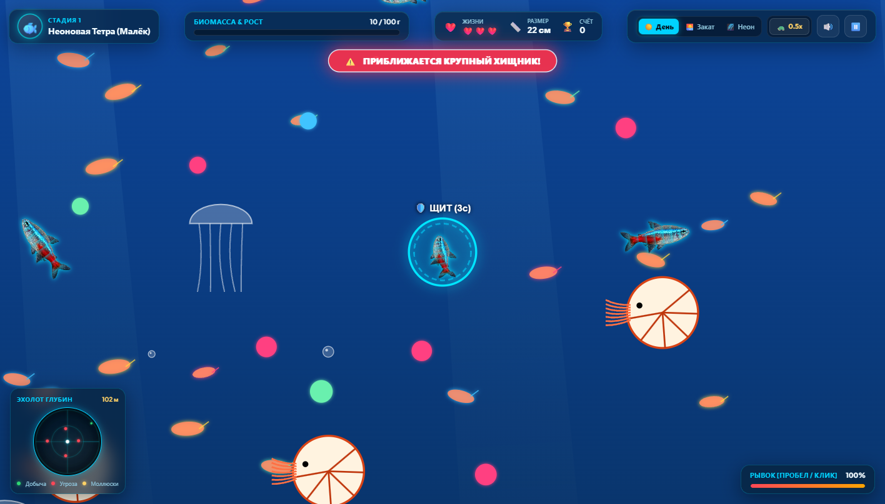

# 🌊 AquaGenesis: Эволюция Океана (FishApp)



**AquaGenesis** — захватывающая аркадная подводная игра в жанре выживания и биологической эволюции, созданная на чистом **JavaScript (Canvas 2D)** и **Web Audio API** с кинематической анимацией рыб, динамическим освещением и процедурным звуком.

Управляйте маленьким мальком в бескрайних океанических глубинах, охотьтесь на светящийся планктон, раскалывайте жемчужные раковины, ловите донных крабов и пожирайте других рыб, избегая смертоносных хищников, чтобы стать легендарным Левиафаном океана!

---

## 🚀 Способы запуска

### 1. ⚡ Мгновенный запуск без установки (1 клик)
Просто откройте файл `index.html` в любом современном браузере (**Google Chrome**, **Microsoft Edge**, **Mozilla Firefox**, **Safari**).  
*Никаких установок, компиляций или подключения к интернету не требуется — игра на 100% автономна!*

---

### 2. 🐳 Запуск через Docker и Docker Compose

В проект включены легковесный `Dockerfile` на базе `nginx:alpine` и `docker-compose.yml`.

#### Вариант А: Быстрый запуск с помощью Docker Compose (рекомендуется)
```bash
docker compose up -d
```
После запуска откройте в браузере: **[http://localhost:8080](http://localhost:8080)**

Чтобы остановить контейнер:
```bash
docker compose down
```

#### Вариант Б: Сборка и запуск напрямую через Docker CLI
```bash
# Сборка образа
docker build -t fishapp .

# Запуск контейнера на порту 8080
docker run -d -p 8080:80 --name fishapp fishapp
```
Для остановки и удаления:
```bash
docker stop fishapp
docker rm fishapp
```

---

### 3. 💻 Запуск через локальный HTTP-сервер

Если вы предпочитаете запуск через локальные среды разработки:

* **С помощью Python 3:**
  ```bash
  python -m http.server 8000
  ```
  Откройте: `http://localhost:8000`

* **С помощью Node.js / npx:**
  ```bash
  npx serve .
  # или
  npx http-server -p 8000
  ```

* **VS Code / IDE:**  
  Используйте расширение *Live Server* (нажмите *"Go Live"* в правом нижнем углу).

---

## 🕹️ Управление

| Устройство | Действие | Управление |
|---|---|---|
| **ПК (Мышь)** | Плавание | Перемещение курсора мыши (рыба плавно следует за курсором) |
| **ПК (Клавиатура)** | Плавание | Клавиши `W`, `A`, `S`, `D` или стрелки клавиатуры |
| **ПК** | Турбо-рывок | `Пробел` или зажатие левой кнопки мыши (ЛКМ) |
| **ПК** | Пауза | Клавиша `Escape` или `P` |
| **Смартфоны / Планшеты** | Плавание | Виртуальный сенсорный джойстик слева (или касание экрана) |
| **Смартфоны / Планшеты** | Турбо-рывок | Сенсорная кнопка `⚡ РЫВОК` в правом нижнем углу |

---

## ✨ Ключевые игровые механики

### 🧬 4 Стадии Эволюции
1. **Крошечный Малёк (Неоновая Тетра):** Стартовая стадия (8–15 см). Быстрый и юркий, питается планктоном и мелким крилем.
2. **Рифовый Охотник (Рыба-Клоун / Хирург):** Средний размер (25–50 см). Способен раскалывать створки моллюсков, ловить шустрых донных крабов и поедать мелких рыбок.
3. **Гроза Глубин (Барракуда):** Крупный хищник (80–150 см). Высокая скорость рывка, острые челюсти, активная охота на обитателей рифа.
4. **Легендарный Левиафан (Акула / Глубоководный гигант):** Вершина пищевой цепи (3–6 метров). Невероятная сила и сокрушительная биомасса.

### 💖 Система Жизней и Защитный Щит
* У игрока есть запас из **3 жизней** (`❤️❤️❤️`), отображаемый в HUD.
* При атаке настоящего крупного хищника игрок теряет 1 жизнь и получает **3-секундный энергетический щит неуязвимости** (`🛡️ ЩИТ`) с отталкивающим импульсом (knockback) и визуальным мерцанием, позволяющим спастись бегством.
* **Восстановление жизней:** сбор открытых жемчужных раковин-жемчужниц (`🦪`) восстанавливает **+1 жизнь**!
* Каждая успешная эволюция на новую стадию **полностью восстанавливает все 3 жизни**.

### 🌊 Реалистичная гидродинамика и физика воды
* **Упругое расталкивание тел:** рыбы не застревают и не слипаются при столкновении. При сближении применяется закон сохранения импульса с учётом массы — создания мягко и естественно огибают друг друга в воде.
* **Процедурная кинематика скелета (IK):** тело рыб состоит из сочленённых сегментов с плавным изгибом позвоночника и синхронным взмахом хвостовых плавников.

### 🦪 Живая океаническая фауна
* **Донные моллюски и жемчужницы:** створки открываются и закрываются. Открытая жемчужина даёт двойную биомассу и восстанавливает здоровье!
* **Донные крабы:** ползают по песчаному дну и защищаются клешнями при опасности.
* **Глубоководные наутилусы:** парят в воде с помощью реактивной тяги.
* **Люминесцентные медузы:** ритмично пульсируют колоколами.
* **Сбалансированный ИИ:** мирные рыбы плавают стаями и спасаются бегством; настоящие верховные хищники выслеживают добычу.

### 💡 3 Режима освещения и атмосферы
* ☀️ **Дневной риф (Day):** Кристально-чистая лазурная вода, колышущиеся водоросли, яркие солнечные лучи (*God Rays*).
* 🌅 **Золотой закат (Sunset):** Тёплый янтарный свет, глубокие тени и кинематографичный закатный горизонт.
* 🌌 **Абиссальный неон (Neon):** Таинственная биолюминесценция глубин, неоновые паттерны, светящиеся фотофоры и ореолы света.

### 🔊 Процедурный звук (Web Audio API)
Все звуковые эффекты генерируются динамически в реальном времени с помощью осцилляторов и фильтров без использования тяжелых mp3/wav файлов:
* Океанический низкочастотный гул течений;
* Сочный хруст добычи и чавканье;
* Бульканье пузырьков и всплески воды;
* Ударная звуковая волна при рывке;
* Тревожный пульс сонара при приближении опасного хищника;
* Торжественные фанфары при эволюции.

---

## 📁 Структура проекта

```
fishapp/
├── index.html            # Главная веб-страница, Canvas, разметка HUD и окон
├── style.css             # Стили оформления, Glassmorphism, адаптивность
├── Dockerfile            # Легковесный контейнер для Nginx Alpine
├── docker-compose.yml    # Конфигурация запуска Docker Compose на порту 8080
├── .dockerignore         # Исключения для сборки Docker
├── .gitignore            # Игнорируемые системные и временные файлы
├── game_screenshot.png   # Скриншот игрового процесса
├── test_simulate.js      # Набор модульных тестов механик игры
├── assets/               # Текстуры и спрайты морских обитателей
│   ├── neontetra.png
│   ├── clownfish.png
│   ├── bluetang.png
│   ├── yellowtang.png
│   ├── lionfish.png
│   ├── barracuda.png
│   ├── shark.png
│   ├── clam.png
│   ├── crab.png
│   ├── nautilus.png
│   └── krill.png
└── js/                   # Исходный код игрового движка
    ├── audio.js          # Процедурный синтезатор звуков (Web Audio API)
    ├── assets.js         # Загрузчик и кэш графических спрайтов
    ├── creature.js       # Классы Fish, кинематика IK, ИИ поведения
    ├── mollusk.js        # Классы Clam, Crab, Nautilus, Plankton, Jellyfish
    ├── environment.js    # Освещение, God Rays, водоросли, кораллы, частицы
    └── game.js           # Игровой цикл, камера, коллизии, физика, HUD
```

---

## 🧪 Тестирование логики

В репозиторий включен автоматический тест механик столкновений, расчёта урона, системы жизней и эволюции:

```bash
node test_simulate.js
```
Тест валидирует:
* Корректную отработку физического расталкивания без зависания;
* Мирное взаимодействие с рифовыми рыбами без получения урона;
* Списание 1 жизни и активацию 3-секундного щита при укусе хищником;
* Наступление Game Over строго при 0 жизней;
* Восстановление жизней при эволюции и поедании жемчуга.

---

## 📄 Лицензия

Проект распространяется под лицензией **MIT**. Наслаждайтесь океаном и приятной игры! 🐟🌊
